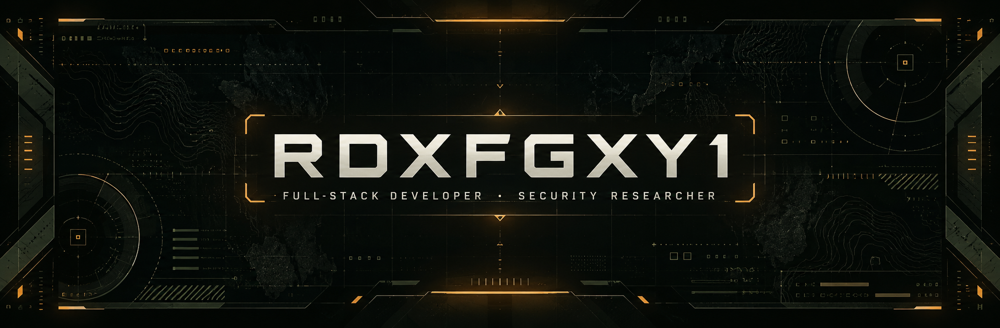

<!-- RDXFGXY1 profile README — intentionally organized as two dashboard panels. -->

<div align="center">



<br />

[](https://github.com/RDXFGXY1)
[](https://github.com/RDXFGXY1)
[](https://github.com/RDXFGXY1?tab=followers)

<br /><br />

<samp>SECURITY FIRST　◆　PRODUCT MINDED　◆　ALWAYS BUILDING</samp>

</div>

## ◢ DASHBOARD 01 // PROFILE MATRIX ◣


<table>
<tr>
<td width="51%" valign="top">

### `[ 01-A ]` About Me

```yaml
identity:   Full-stack developer & security researcher
focus:      Secure application development
status:     Open to collaboration
principles: Security / Privacy / UX / Clean design
```

I build next-generation web applications, browser tools, AI integrations, automation, bots, and immersive game experiences. I enjoy working across languages and turning ambitious ideas into useful, polished software.

> **DESIGN PRINCIPLE**  
> “Code isn't just instructions for machines—it's poetry for problem-solving. Every line should either solve a problem or inspire a solution.”

### `[ LINK ]` Connect

[](https://discord.gg/aFvUxKejw4)
[](mailto:nullstudio.dev@proton.me)
[](https://gist.github.com/RDXFGXY1)

</td>
<td width="49%" valign="top">

### `[ 01-B ]` Tech Stack

**◈ LANGUAGES**


**◈ FRAMEWORKS & DATA**


**◈ PLATFORMS & TOOLS**


</td>
</tr>
</table>

<div align="center">

<samp>PROFILE SIGNAL // STABLE　·　WORKFLOW // ITERATIVE　·　QUALITY // PRIORITY</samp>

</div>

## ◢ DASHBOARD 02 // DEVELOPMENT OVERVIEW ◣


<table>
<tr>
<td width="50%" valign="top">

### `[ 02-A ]` Projects

#### ◈ [NYX](https://github.com/RDXFGXY1/nyx)

Local-first new-tab replacement for Brave and Chrome, with bookmarks, translation, local media, customization, and privacy-focused utilities.

`JavaScript` `CSS` `HTML` `Browser Extension`

[](https://github.com/RDXFGXY1/nyx)

#### ◈ [ORION HOME SERVICES AI](https://github.com/RDXFGXY1/OrionHomeServices-AI)

AI-assisted home-services platform with multimodal diagnostics, intelligent workflows, contractor coordination, and structured service management.

`TypeScript` `React` `Tailwind CSS` `Gemini`

[](https://github.com/RDXFGXY1/OrionHomeServices-AI)

</td>
<td width="50%" valign="top">

### `[ 02-B ]` GitHub Stats

<picture>
  <source media="(prefers-color-scheme: dark)" srcset="https://github-readme-stats.vercel.app/api?username=rdxfgxy1&show_icons=true&hide_border=true&rank_icon=github&bg_color=0d120f&title_color=d9a441&text_color=c8cec5&icon_color=87957f" />
  <source media="(prefers-color-scheme: light)" srcset="https://github-readme-stats.vercel.app/api?username=rdxfgxy1&show_icons=true&hide_border=true&rank_icon=github&bg_color=f3f1e9&title_color=8a6115&text_color=263029&icon_color=66735f" />
  
</picture>

### `[ 02-C ]` Languages

<picture>
  <source media="(prefers-color-scheme: dark)" srcset="https://github-readme-stats.vercel.app/api/top-langs/?username=rdxfgxy1&layout=compact&hide_border=true&langs_count=8&bg_color=0d120f&title_color=d9a441&text_color=c8cec5" />
  <source media="(prefers-color-scheme: light)" srcset="https://github-readme-stats.vercel.app/api/top-langs/?username=rdxfgxy1&layout=compact&hide_border=true&langs_count=8&bg_color=f3f1e9&title_color=8a6115&text_color=263029" />
  
</picture>

<sub>Language cards reflect public repository code, not proficiency.</sub>

</td>
</tr>
<tr>
<td colspan="2" align="center">

### `[ 02-D ]` Activity

<picture>
  <source media="(prefers-color-scheme: dark)" srcset="https://github-readme-activity-graph.vercel.app/graph?username=rdxfgxy1&bg_color=0d120f&color=c8cec5&line=d9a441&point=87957f&area=true&area_color=66735f&hide_border=true&custom_title=Contribution%20Activity" />
  <source media="(prefers-color-scheme: light)" srcset="https://github-readme-activity-graph.vercel.app/graph?username=rdxfgxy1&bg_color=f3f1e9&color=263029&line=8a6115&point=66735f&area=true&area_color=c6b27c&hide_border=true&custom_title=Contribution%20Activity" />
  
</picture>

### `[ SUPPORT ]` Support My Work

[](https://paypal.me/ayoubzel)
[](https://github.com/sponsors/RDXFGXY1)
[](https://patreon.com/NullStudio001)
[](https://ko-fi.com/kyrosdev)

</td>
</tr>
</table>

<div align="center">

<samp>◢ ORIGINAL FPS-HUD INSPIRED PROFILE // BUILD CONTINUOUS ◣</samp>

<br /><br />


</div>
